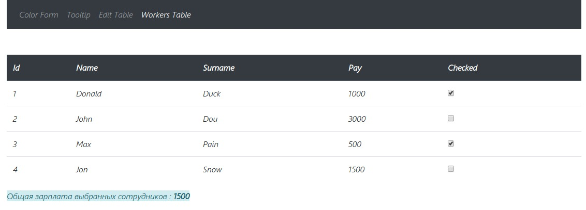

# React Router TypeScript example

It is simple code example TypeScript and Router in React.js

If you want to start the project, install build configuration [react-create-app](https://github.com/facebook/create-react-app "react-create-app") and run ***npm install*** for install all dependencies

I use react-router-dom and @types/react-router-dom for type.

I use [react-router-dom](https://github.com/ReactTraining/react-router/tree/master/packages/react-router-dom) for routing in project. And [@types/react-router-dom](https://www.npmjs.com/package/@types/react-router-dom) for TypeScript.

